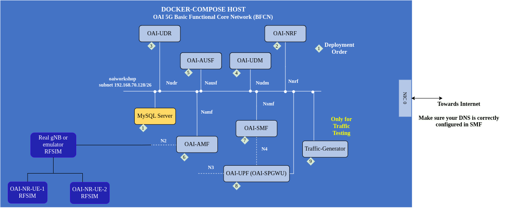

<table style="border-collapse: collapse; border: none;">
  <tr style="border-collapse: collapse; border: none;">
    <td style="border-collapse: collapse; border: none;">
      <a href="http://www.openairinterface.org/">
         
         </img>
      </a>
    </td>
    <td style="border-collapse: collapse; border: none; vertical-align: center;">
      <b><font size = "5">OpenAirInterface 5G Core Network Summer Workshop 2023</font></b>
    </td>
  </tr>
</table>




The aim of this tutorial is to explain: 

1. How to configure OAI5G Core network
2. How it works end to end with a RF Simulated `oai-gnb` and `oai-nr-ue`
3. (Optional): Connect two UEs to the gNB in two different slices
4. (Optional): Configure a static ip-address for a UE in the UDR database

**Hardware Requirements**

1. A laptop or remote server with minimum 8vCPU and 16GB of RAM and 4GB of storage. Most of the CPU and RAM is consumed by OAI gNB and NR-UE RFSimulator. Core network requires minimum 2vCPU and 4GB RAM.
2. Make sure your laptop/remote server cpu supports `avx2`. You can check via `lscpu | grep avx2`
3. Operating System: Ubuntu 20.04 or 22.04. 
4. Note: macOS and new M1/M2 laptops are not yet tested and Windows Linux Subsystem (WSL) is not yet tested

**Software Prerequisites**

|Software      |Version                                       |
|:-------------|:---------------------------------------------|
|docker engine |Minimum 19.03.6                               |
|docker-compose|Minimum 1.27.4                                |
|tshark        |Minimum 3.6.2 (Git v3.6.2 packaged as 3.6.2-2)|
|wireshark     |Minimum 3.6.2 (Git v3.6.2 packaged as 3.6.2-2)|

**NOTE**: 

1. If you are using docker engine version > 21 then `compose` command is included in `docker`. If you do not have docker installed [then follow the official link](https://docs.docker.com/engine/install/).
2. It is recommended to use a docker account when you are pulling images. On dockerhub there is a limit for `anonymous` pull request. Probably at the day of the workshop not everyone will be able to pull the images. So it is good if you pull images in advance.

**Reading time**: ~ 20mins

**Tutorial replication time**: ~ 60mins

**TABLE OF CONTENTS**

[[_TOC_]]

## 1. Creating the Environment

1. Create a folder where you can store all the result files of the tutorial and this repository

``` shell
mkdir -p /tmp/oaisummerworkshop2023
cd /tmp/oaisummerworkshop2023
git clone https://gitlab.eurecom.fr/oaiworkshop/summerworkshop2023.git
cd /tmp/oaisummerworkshop2023/summerworkshop2023/cn
```

2. Make sure you have either `docker compose` command or standalone `docker-compose` command. In case you want to install `docker-compose` standalone command then follow the below steps or this [link](https://docs.docker.com/compose/install/standalone/)

```bash
curl -SL https://github.com/docker/compose/releases/download/v2.18.0/docker-compose-linux-x86_64 -o /usr/local/bin/docker-compose
sudo ln -s /usr/local/bin/docker-compose /usr/bin/docker-compose
```

3. (Optional): Pull all the container images which are required in this tutorial. In case you do not want to pull the images now `docker-compose` will pull the images for you. 

```bash
##Recommended to login to your docker hub account
docker login
## Pull images
docker pull oaisoftwarealliance/oai-amf:v1.5.1
docker pull oaisoftwarealliance/oai-smf:v1.5.1
docker pull oaisoftwarealliance/oai-nrf:v1.5.1
docker pull oaisoftwarealliance/oai-udr:v1.5.1
docker pull oaisoftwarealliance/oai-udm:v1.5.1
docker pull oaisoftwarealliance/oai-ausf:v1.5.1
docker pull oaisoftwarealliance/oai-spgwu-tiny:v1.5.1
## Your choice if you want to pull develop images for RAN then you can use develop
docker pull oaisoftwarealliance/oai-nr-ue:2023.w19
docker pull oaisoftwarealliance/oai-gnb:2023.w19
```

4. (Optional) In case you do not have wireshark you can install 

```bash
sudo add-apt-repository ppa:wireshark-dev/stable
sudo apt update
sudo apt install wireshark
```

5. (Optional) if you want to run the gNB and core in different machines then you need some forwarding rules. 

```bash
sudo sysctl net.ipv4.conf.all.forwarding=1
sudo iptables -P FORWARD ACCEPT
# You also need to add a route in the gNB to access the core network
sudo ip route add route CORE_NETWORK_DOCKER_SUBNET via IP_ADDRESS_OF_CORE_NETWORK_HOST_MACHINE dev gNB_NIC_TOWARDS_CORE_NETWORK
```

## 2. Configuring the OAI-5G Core Network Functions

The [docker-compose](./docker-compose.yml) file has configuration parameters for each core network component. The file is pre-configured with parameters related to this scenario. The table contains the location of the configuration files. These files contain allowed configurable parameters.

| File Name   | Repository    |Location                                           |
|:----------- |:-------------------------------------------- |:-------------------|
| amf.conf    | (Gitlab) cn5g/oai-cn5g-amf                   | [etc/amf.conf](https://gitlab.eurecom.fr/oai/cn5g/oai-cn5g-amf/-/blob/master/etc/amf.conf) |
| smf.conf    | (Gitlab) cn5g/oai-cn5g-smf                   | [etc/smf.conf](https://gitlab.eurecom.fr/oai/cn5g/oai-cn5g-smf/-/blob/master/etc/smf.conf) |
| nrf.conf    | (Gitlab) cn5g/oai-cn5g-nrf                   | [etc/nrf.conf](https://gitlab.eurecom.fr/oai/cn5g/oai-cn5g-nrf/-/blob/master/etc/nrf.conf)  |
| spgw_u.conf | (Github) OPENAIRINTERFACE/openair-spgwu-tiny | [etc/spgw_u.conf](https://github.com/OPENAIRINTERFACE/openair-spgwu-tiny/blob/master/etc/spgw_u.conf) |
| udr.conf    | (Gitlab) cn5g/oai-cn5g-udr                   | [etc/udr.conf](https://gitlab.eurecom.fr/oai/cn5g/oai-cn5g-udr/-/blob/master/etc/udr.conf)            |
| udm.conf    | (Gitlab) cn5g/oai-cn5g-udm                   | [etc/udm.conf](https://gitlab.eurecom.fr/oai/cn5g/oai-cn5g-udm/-/blob/master/etc/udm.conf)            |
| ausf.conf   | (Gitlab) cn5g/oai-cn5g-ausf                  | [etc/ausf.conf](https://gitlab.eurecom.fr/oai/cn5g/oai-cn5g-ausf/-/blob/master/etc/ausf.conf)         |

## 3. Deploying OAI 5g Core Network

1. Create docker network interface so that we can capture initial packets to understand what happens when core network starts

```bash
docker network create --driver=bridge --subnet=192.168.70.128/26 -o "com.docker.network.bridge.name"="oaiworkshop" oaiworkshop
```
2. Run wireshark with `root` privileges select `oaiworkshop` interface or you can capture packets using `tshark` command. 

```bash
sudo tshark -i oaiworkshop -f "(not host 192.168.70.135 and not arp and not port 53 and not port 2152) or (host 192.168.70.135 and icmp)" -w /tmp/oaiworkshop'
```

3. Start the core network (make sure you are in `summerworkshop2023/cn` repository)

```bash
cd summerworkshop2023/cn
docker compose -f docker-compose.yml up -d
```

4. Wait for the core network to be healthy. You can check the core network state using

```bash
docker-compose -f docker-compose.yml ps -a
```

5. In this configuration of core network:

  - AMF subscribes to SMF registration event via NRF for SMF selection
  - SMF registers to NRF
  - SMF subscribes to UPF registration event via NRF for UPF discovery
  - UPF registers to NRF

We can check all these requests from the PCAPs or logs. 

6. PFCP heartbeat exchange between SMF and UPF

## 4. Deploying OAI-GNB RFSIM

In the RAN workshop you much have learned how to use oai-gnb. Here we are using oai-gnb rfsimulator in docker container. In case you want to run it without docker then you can do that. 

Open three terminals and in one terminal type

```bash
docker logs oai-amf -f
```

Second terminal

```bash
docker logs oai-smf -f
```

Third terminal

```bash
docker compose -f docker-compose-ran.yml up -d oai-gnb
```

Wait for the gNB to be healthy and meanwhile you can check the logs of `oai-amf`.

Open a fourth terminal and start the UE.

```bash
docker compose -f docker-compose-ran.yml up -d oai-nr-ue
```
Check the logs of `oai-amf` and `oai-smf`. You might have received an ip-address.

Get inside the UE and try to ping `8.8.8.8` or `12.1.1.1` or `192.168.70.135`

```bash
docker exec -it oai-nr-ue bash
## ping towards internet
ping -I oaitun_ue1 8.8.8.8 -c4
## ping towards upf/spgwu
ping -I oaitun_ue1 12.1.1.1 -c4
## ping towards oai-traffic-generator
ping -I oaitun_ue1 192.168.70.135 -c4
## Iperf testing
iperf3 -B <UE_IP_ADDRESS> -c 192.168.70.135 -u -R -b20M
```

(optional) Connect the second UE and check `oai-amf` and `oai-smf` logs

```bash
docker compose -f docker-compose-ran.yml up -d oai-nr-ue2
```

```bash
docker exec -it oai-nr-ue2 bash
## ping towards internet
ping -I oaitun_ue1 8.8.8.8 -c4
## ping towards upf/spgwu
ping -I oaitun_ue1 12.1.1.1 -c4
## ping towards oai-traffic-generator
ping -I oaitun_ue1 192.168.70.135 -c4
```
Once you are done with your experiment, please stop the two UEs and gNB in an order using below command, 

```bash
docker stop oai-nr-ue oai-nr-ue2 
docker kill oai-nr-ue oai-nr-ue2
```

Stop the gNB

```bash
docker stop oai-gnb
docker kill oai-gnb
```

Do not stop the core network. 

## 5. Anaylse logs and PCAPs

Normally you will see below messages twice because we connected the 2 UEs and pinged 4 times for each UE.

Below messages are from AMF pcap

1. NGSetupRequest, NGSetupResponse
2. InitialUEMessage, Registration request, Registration request
3. DownlinkNASTransport, Identity request
4. UplinkNASTransport, Identity response
5. DownlinkNASTransport, Authentication request
6. UplinkNASTransport, Authentication response
7. DownlinkNASTransport, Security mode command
8. UplinkNASTransport, Security mode complete, Registration request
9. UERadioCapabilityInfoIndication
10. UplinkNASTransport, Registration complete
11. PDU session establishment request
12. PDUSessionResourceSetupRequest, DL NAS transport, PDU session establishment accept
13. PDUSessionResourceSetupResponse
14. UplinkNASTransport, UL NAS transport, PDU session release request (Regular deactivation)
15. PDUSessionResourceReleaseCommand, DL NAS transport, PDU session release command (Regular deactivation)
16. PDUSessionResourceReleaseResponse
17. UplinkNASTransport, UL NAS transport, PDU session release complete, UplinkNASTransport, Deregistration request (UE originating)
18. SHUTDOWN
19. SHUTDOWN ACK
20. SHUTDOWN_COMPLETE

## 6. Bonus I: Connect Second UE in different slice

Mount the configuration file of RF-Sim [docker-compose-ran.yml](./docker-compose-ran.yml). Follow the steps mention in the comment, uncomment `USE_VOLUMED_CONF` and `volumes` section to mount the configuration file. 

Similarly for `oai-nr-ue2` uncomment `USE_VOLUMED_CONF` and `volumes` section. 

Now start the gNB and then after couple of seconds once gNB is healthy you can start `oai-nr-ue` and then `oai-nr-ue2`. 

What do you observe? Anything different? 

## 7. Bonus II: Configure Static UE Ip-address

Make sure the core network is not running anymore as we have to update the configuration.

```bash
docker compose -f docker-compose.yml down
```

Edit [docker-compose file](./docker-compose.yml), set the parameter `USE_LOCAL_SUBSCRIPTION_INFO` to `no` in the smf service configuration of the docker-compose file. This parameter controllers if SMF takes slicing and DNN information from configuration file or request UDM. 

Another thing at the moment when SMF request UDM for the subscription information, SMF selection at AMF does not work. So you need to disable `SMF_SELECTION` in AMF configuration file. 

``` shell
sed -i 's/USE_LOCAL_SUBSCRIPTION_INFO=yes/USE_LOCAL_SUBSCRIPTION_INFO=no/g' docker-compose.yml
sed -i 's/SMF_SELECTION=yes/SMF_SELECTION=no/g' docker-compose.yml
```

Then configure the [user subscription database sql file](../database/oai_db.sql) with IMSI and DNN information mapping. In the table `SessionManagementSubscriptionData` add below entries

- Static UE ip-address allocation

``` sql
INSERT INTO `SessionManagementSubscriptionData` (`ueid`, `servingPlmnid`, `singleNssai`, `dnnConfigurations`) VALUES
('001010000000101', '00101', '{\"sst\": 1, \"sd\": \"16777215\"}','{\"oai\":{\"pduSessionTypes\":{ \"defaultSessionType\": \"IPV4\"},\"sscModes\": {\"defaultSscMode\": \"SSC_MODE_1\"},\"5gQosProfile\": {\"5qi\": 1,\"arp\":{\"priorityLevel\": 15,\"preemptCap\": \"NOT_PREEMPT\",\"preemptVuln\":\"PREEMPTABLE\"},\"priorityLevel\":1},\"sessionAmbr\":{\"uplink\":\"1000Mbps\", \"downlink\":\"1000Mbps\"},\"staticIpAddress\":[{\"ipv4Addr\": \"12.1.1.200\"}]},\"ims\":{\"pduSessionTypes\":{ \"defaultSessionType\": \"IPV4V6\"},\"sscModes\": {\"defaultSscMode\": \"SSC_MODE_1\"},\"5gQosProfile\": {\"5qi\": 2,\"arp\":{\"priorityLevel\": 15,\"preemptCap\": \"NOT_PREEMPT\",\"preemptVuln\":\"PREEMPTABLE\"},\"priorityLevel\":1},\"sessionAmbr\":{\"uplink\":\"1000Mbps\", \"downlink\":\"1000Mbps\"}}}');
```

- Dynamic ip-address allocation
``` sql
INSERT INTO `SessionManagementSubscriptionData` (`ueid`, `servingPlmnid`, `singleNssai`, `dnnConfigurations`) VALUES 
('001010000000102', '00101', '{\"sst\": 1, \"sd\": \"1\"}','{\"internet\":{\"pduSessionTypes\":{ \"defaultSessionType\": \"IPV4\"},\"sscModes\": {\"defaultSscMode\": \"SSC_MODE_1\"},\"5gQosProfile\": {\"5qi\": 6,\"arp\":{\"priorityLevel\": 1,\"preemptCap\": \"NOT_PREEMPT\",\"preemptVuln\":\"NOT_PREEMPTABLE\"},\"priorityLevel\":1},\"sessionAmbr\":{\"uplink\":\"1000Mbps\", \"downlink\":\"1000Mbps\"}}}');
```

Restart the core network, connect the gNB and start the UE1 and UE2. 

## 8. Remove all the docker containers

Make sure you are always in `summerworkshop2023/cn` folder

```bash
docker compose -f docker-compose.yml down -t2
docker compose -f docker-compose-ran.yml down -t2
```

## 9. Extra

1. If you want to see the resource consumption of `docker containers` you can use `docker stats`
2. If you want to see the processes running inside a contianer you can do `docker top`
